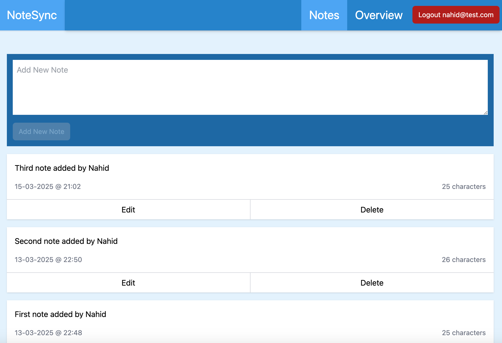
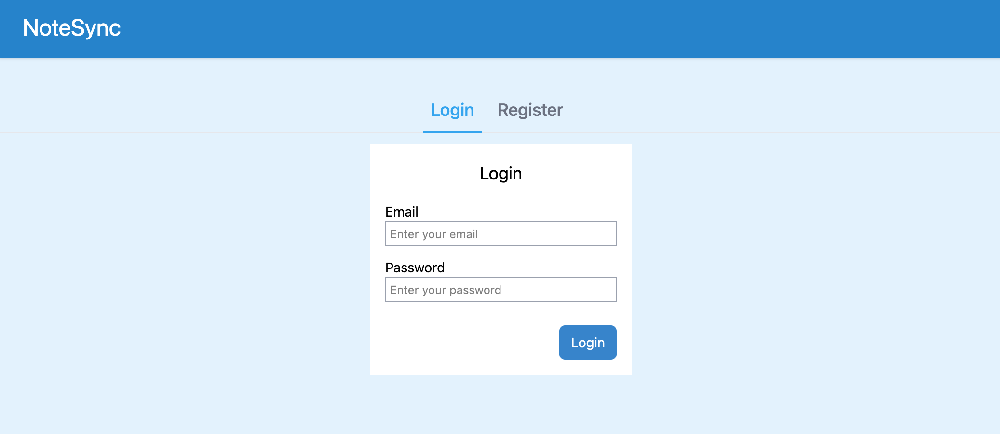
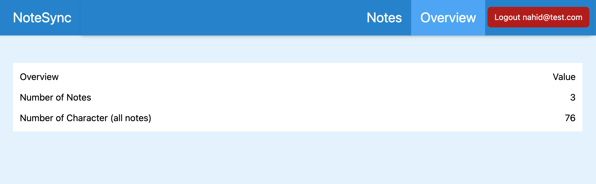

# NoteSync

NoteSync is a single-page web app that allows users to create an account, access their personalized dashboard, and manage their notes with ease. Users can add, edit, and delete notes, with real-time synchronization across devices.

## Features

- User authentication with Firebase (Login & Logout)
- Secure, multi-user access with personalized note management
- Real-time data synchronization across devices
- Navigation guards & Firebase security rules for data privacy
- Deployment to production using Firebase Hosting

For step-by-step implementation, check the [Project Implementation Guide](./docs/implementation-guide.md).

## Tech Stack

This app is built using:

- **Vue 3** (Composition API, Vue Router, Pinia for state management)
- **JavaScript**
- **Pinia** (State management)
- **Tailwind CSS** (Styling)
- **Firebase** (Authentication, Firestore, Hosting)

## App Screenshots







## Vue 3 Concepts Covered

This app demonstrates key `Vue 3` concepts, including:

- **Vue Router** (`useRoute`, `useRouter`, & `composables`)
- **Reactivity** (`ref`, `computed`,  `reactive` objects)
- **Component communication** (`props`, `emits`, `modelValue` )
- **`Template refs` & `composables`** (including custom composables and `vue-use` library)
- `directives`  & lifecycle `hooks` 
- `pinia` state management

## Recommended IDE Setup

For an optimized development experience, refer to the [Vue Docs Scaling Up Guide](https://vuejs.org/guide/scaling-up/tooling.html#ide-support).

## Project Setup

This project is set up with Vue 3 and Vite. It uses `<script setup>` in Vue SFCs. Learn more in the [Vue script setup docs](https://v3.vuejs.org/api/sfc-script-setup.html#sfc-script-setup).

### Install Dependencies

```sh
pnpm install
```

### Run in Development Mode

```sh
pnpm dev
```

### Build for Production

```sh
pnpm build
```

## References

- [Vite Documentation](https://vite.dev/)
- [Vue.js Documentation](https://vuejs.org/)
- [Vue Router Documentation](https://router.vuejs.org/)
- [Vue Router - Navigation Guards](https://router.vuejs.org/guide/advanced/navigation-guards.html)
- [Tailwind CSS Installation (Vite)](https://tailwindcss.com/docs/installation/using-vite)
- [Material Icons Documentation](https://developers.google.com/fonts/docs/material_icons)
- [Pinia Store Documentation](https://pinia.vuejs.org/)
- [Firebase Documentation](https://firebase.google.com/)
- [Cloud Firestore Documentation](https://firebase.google.com/docs/firestore)